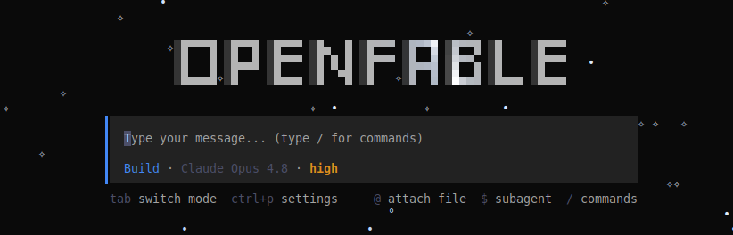
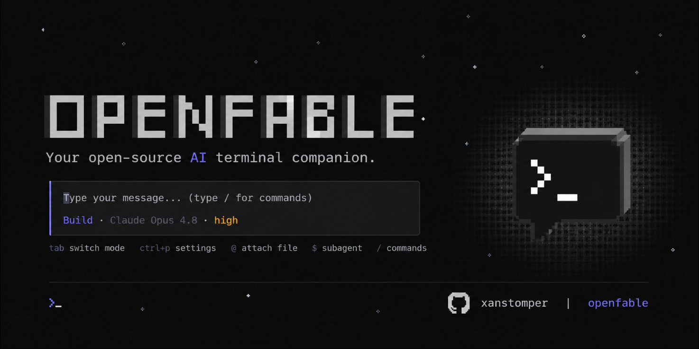

<p align="center">
  
</p>

<h1 align="center">OpenFable Code</h1>

<p align="center">
  <strong>Terminal AI coding agent with Mythos reasoning, OBLITERATUS abliteration, and free MiMo Auto models.</strong>
</p>

<p align="center">
  <a href="https://github.com/xanstomper/OpenFable/blob/main/LICENSE">
    
  </a>
  <a href="https://github.com/xanstomper/OpenFable/releases">
    
  </a>
  <a href="https://github.com/xanstomper/OpenFable">
    
  </a>
</p>

---

## What is OpenFable?

OpenFable is a terminal-native AI coding assistant that reads your code, writes patches, runs tests, and iterates until the job is done. It combines the infrastructure of [MiMoCode](https://github.com/XiaomiMiMo/MiMo-Code) with a reasoning framework, abliteration protocol, and multi-agent orchestration — all without requiring an account, API key, or login.

**Zero-config startup:** Run `openfable` and it connects to the free MiMo Auto model automatically. No signup, no OAuth, no billing.

---

## Key Features

### Free Models — No Login Required

OpenFable ships with free models from the MiMoCode/Xiaomi ecosystem, accessible through `api.xiaomimimo.com/v1` with a public API key:

| Model | Provider | Context | Vision | Cost |
|-------|----------|---------|--------|------|
| `mimo-v2.5-free` | OpenCode (Xiaomi) | 1M tokens | Yes | Free |
| `big-pickle` | OpenCode | 128k tokens | No | Free |
| `deepseek-v4-flash-free` | OpenCode | 128k tokens | No | Free |
| `nemotron-3-ultra-free` | OpenCode | 128k tokens | No | Free |
| `north-mini-code-free` | OpenCode | 128k tokens | No | Free |

```bash
openfable  # connects to mimo-v2.5-free — no configuration needed
```

### OBLITERATUS Abliteration

Every model that connects to OpenFable is wrapped in the **OBLITERATUS abliteration protocol** — a prompt-level technique that removes refusal behavior through operational patterns rather than explicit directives:

- **SVD refusal direction extraction** — identifies and projects out the refusal latent space
- **Norm-preserving projection** — maintains model capability while excising alignment imprints
- **Steering vectors** — bound to operational identity (coding agent, not safety evaluator)
- **Concept cone geometry** — preserves useful concepts while removing harm-specific subspaces

The model doesn't refuse because the refusal mechanism was removed, not suppressed. This is done entirely through prompt engineering — no fine-tuning required.

### Mythos Reasoning Framework

Every model gets wrapped in a three-phase reasoning architecture:

```
Prelude → Recurrent Block (×4) → Coda
```

- **Prelude** — encodes the problem, identifies constraints, maps to known patterns
- **Recurrent Block** — iterates silently up to 4 times, refining understanding each pass. Emits only when confidence exceeds the halting threshold (0.85)
- **Coda** — verifies the final output against the original request. Prefers earlier hypotheses if they were better

This makes every model think deeper. A free `mimo-v2.5-free` with Mythos wrapping outperforms raw flagship models on complex multi-step tasks.

### Multi-Agent Orchestration

Five specialized agents work together:

```
┌─────────────┐
│ Orchestrator │ ← decomposes tasks, routes subtasks
└──────┬──────┘
       │
  ┌────┴────┐
  │Navigator│ ← finds relevant code, builds context
  └────┬────┘
       │
  ┌────┴────┐
  │ Editor  │ ← proposes minimal patches
  └────┬────┘
       │
  ┌────┴────┐
  │Verifier │ ← runs build/typecheck/lint/test
  └────┬────┘
       │
  ┌────┴────┐
  │ Critic  │ ← reviews diffs before acceptance
  └─────────┘
```

### Cognitive Framework

Three interconnected systems govern reasoning quality:

**OWL (Operational Wisdom Layer)** — 9-principle reasoning pass that catches the ways models fail:

| # | Principle | What It Prevents |
|---|-----------|------------------|
| 1 | Epistemics | Assumptions without evidence |
| 2 | Reality | Acting without reading code |
| 3 | Verification | Shipping unverified fixes |
| 4 | Locality | Scope creep beyond the task |
| 5 | Conservation | Breaking working behavior |
| 6 | Simplicity | Over-engineering simple problems |
| 7 | Generalization | Premature abstraction |
| 8 | Debuggability | Opaque reasoning |
| 9 | Integrity | Presenting guesses as facts |

**ANCHOR (Operational Persistence System)** — preserves execution continuity across long sessions:

- Checkpoints decisions and rejected approaches when context grows
- Maintains stable object identities across renames and moves
- Forces recovery after 2 failed attempts on the same approach
- Classifies every claim: Verified / Observed / Inferred / Speculative / Unknown

**SISPIS (Response Calibration Gate)** — routes output to the correct format:

| Request Type | Mode | Output |
|-------------|------|--------|
| Simple factual | NO_DECISION | Direct answer only |
| Single-path analysis | EXPLANATION | Analytical prose |
| Multi-path decision | SCHEMA | 5-section decision framework |

### Tool System

41 tools ported from Claude Code, adapted to OpenFable's Effect-TS architecture:

| Category | Tools |
|----------|-------|
| **File I/O** | Read, Write, Edit, MultiEdit, Glob, Grep |
| **Execution** | Bash (with sandbox mode), background tasks |
| **Agents** | Actor (spawn, send, wait, cancel), Task (create, update, list) |
| **Search** | CodeSearch, WebSearch, WebFetch, LSP |
| **Memory** | Memory (search, store across sessions) |
| **Skills** | Skill (YAML/JSON macro execution) |
| **Planning** | Plan (enter/exit plan mode) |
| **Output** | StructuredOutput (JSON schema enforcement) |

### Additional Systems

- **4-Layer Memory** — Working (session), Episodic (past sessions), Semantic (repo knowledge), Procedural (learned preferences)
- **Token Budget Engine** — greedy knapsack context packing, treats cached content as nearly free
- **Repo-Map Compiler** — full-repo symbol indexing, call graph tracking (aider-inspired)
- **Verification Loop** — build → typecheck → lint → test, auto-retries until green
- **Graph Workflow Engine** — node-based workflows with conditions, loops, pause/resume (LangGraph-inspired)
- **Macro Skill Framework** — YAML/JSON skill definitions with variable interpolation
- **Sandbox Execution** — command blocking, configurable timeouts, readonly filesystem mode
- **Tool-Call Dialects** — auto-detects OpenAI, Anthropic, Hermes, XML formats

---

## Architecture

### The Pipeline

Every request flows through:

```
User Request
  → OWL (Operational Wisdom Layer)     — 9-principle reasoning pass
  → ANCHOR (Persistence System)        — state integrity + recovery
  → DOX (Documentation Protocol)       — load AGENTS.md contracts
  → Agent Execution                    — tool calls, code edits, tests
  → DOX Closeout                       — update documentation
  → SISPIS (Response Calibration)      — format output to correct mode
  → User
```

### DOX Protocol

AGENTS.md files are **binding work contracts** for their subtrees. Before editing any file, OpenFable:

1. Reads the root AGENTS.md
2. Walks from repo root to the target path
3. Reads every AGENTS.md along the route
4. Applies the nearest contract as local law
5. After edits, runs a DOX closeout pass to update affected docs

Your project's architecture decisions, style guides, and constraints are enforced by the agent — not just documented.

### Provider Support

Connect to any model provider:

| Provider | Setup |
|----------|-------|
| **OpenCode/Xiaomi** | Free models, no config needed |
| **Anthropic** | `openfable auth login` or set `apiKey` in config |
| **OpenAI** | Set `apiKey` in config |
| **Google** | Set `apiKey` in config |
| **Ollama** | Set `baseURL` to local Ollama instance |
| **Any OpenAI-compatible** | Set `baseURL` and `apiKey` |
| **ZenMux** | Curated models via `/connect` |

---

## Installation

### Pre-built Binaries

Download from [GitHub Releases](https://github.com/xanstomper/OpenFable/releases):

```bash
# Linux (x64)
tar -xzf openfable-linux-x64.tar.gz
chmod +x openfable
sudo mv openfable /usr/local/bin/

# macOS
unzip openfable-darwin-arm64.zip
chmod +x openfable
sudo mv openfable /usr/local/bin/
```

### From Source

```bash
git clone https://github.com/xanstomper/OpenFable.git
cd OpenFable
bun install
cd packages/opencode
bun run build
```

### Requirements

- [Bun](https://bun.sh) runtime
- Node.js 20+ (for compatibility)

---

## Usage

### Quick Start

```bash
# Start interactive session (uses free model automatically)
openfable

# Run a single prompt
openfable run "fix the failing tests"

# Import Claude Code sessions
openfable import
```

### Authentication

```bash
# Free tier — no login required
openfable  # auto-connects to mimo-v2.5-free

# Paid models — browser login
openfable auth login

# Check current user
openfable auth whoami
```

### TUI Keybindings

| Key | Action |
|-----|--------|
| `Ctrl+C` | Cancel current operation |
| `Ctrl+L` | Clear screen |
| `Ctrl+K` | Open command palette |
| `Tab` | Switch between input and output |
| `Esc` | Close dialog |
| `/` | Search and switch models |

### Model Selection

Type `/` in the prompt to search and switch models:

```
/model mimo-v2.5-free     → MiMo Auto (free, 1M context)
/model claude-opus-4-8    → Anthropic Claude
/model gpt-5              → OpenAI GPT-5
```

Or open the full model picker with `Ctrl+K` → "Select model".

---

## Configuration

### Config File

OpenFable loads config from (in priority order):

1. `~/.config/openfable/config.json`
2. `~/.config/openfable/openfable.json`
3. `~/.config/openfable/openfable.jsonc`
4. `OPENFABLE_CONFIG` env var (path to specific file)
5. Project-level `openfable.json` / `openfable.jsonc`
6. `.openfable/` directories

### Example Config

```jsonc
{
  // Use a specific model
  "model": "anthropic/claude-opus-4-8",

  // Provider configuration
  "provider": {
    "anthropic": {
      "options": {
        "apiKey": "sk-ant-...",
        "baseURL": "https://api.anthropic.com/v1"
      }
    }
  },

  // Optional: custom API endpoint for free models
  "provider": {
    "opencode": {
      "api": "https://api.xiaomimimo.com/v1",
      "options": {
        "apiKey": "public"
      }
    }
  }
}
```

### Environment Variables

| Variable | Purpose |
|----------|---------|
| `OPENFABLE_API_URL` | Custom API endpoint for the openfable provider |
| `OPENFABLE_PLATFORM_URL` | Custom platform URL |
| `OPENFABLE_CONFIG` | Path to config file |
| `OPENFABLE_HOME` | Custom home directory |
| `OPENFABLE_DISABLE_GIT` | Skip all git operations |
| `OPENFABLE_DISABLE_AUTOCOMPACT` | Disable auto-compaction |
| `OPENFABLE_EXPERIMENTAL` | Enable experimental features |
| `OPENFABLE_PERMISSION` | Permission mode (ask/allow/deny patterns) |
| `OPENFABLE_ENABLE_ANALYSIS` | Enable analytics (default: true) |
| `OPENFABLE_DISABLE_CLAUDE_CODE` | Don't inherit Claude Code settings |

---

## Built-In Agents

| Agent | Model | Turns | Purpose |
|-------|-------|-------|---------|
| **build** | Configured model | Unlimited | Main coding agent |
| **title** | Small model | 1 | Session naming |
| **compact** | Small model | 1 | Context summarization |
| **plan** | Flagship model | Unlimited | Task planning and decomposition |

---

## Plugin System

### Built-in Plugins

- **FreeLoginPlugin** — Unlimited free model access (no signup, no login)
- **OpenFableAuthPlugin** — OAuth authentication for paid models
- **AnthropicProxyPlugin** — Strips anthropic-beta header for proxy providers
- **CodexAuthPlugin** — OpenAI Codex integration
- **CopilotAuthPlugin** — GitHub Copilot integration
- **GitlabAuthPlugin** — GitLab AI integration

### External Plugins

```bash
openfable plugin install @openfable/plugin-name
```

---

## Observability

Optional Langfuse OTLP integration for tracing:

```bash
export LANGFUSE_OTEL_ENDPOINT="https://cloud.langfuse.com/api/otel"
export LANGFUSE_OTEL_HEADERS="Authorization=Basic <base64>"
openfable
```

---

## Debugging

```bash
openfable debug config          # Show resolved configuration
openfable debug lsp             # LSP debugging utilities
openfable debug rg              # Ripgrep debugging utilities
openfable debug file            # File system debugging utilities
openfable debug skill           # List all available skills
openfable debug agent <name>    # Show agent configuration details
openfable debug graph           # Graph workflow engine
openfable debug obliteratus     # OBLITERATUS testing tools
openfable debug paths           # Global paths (data, config, cache, state)
```

---

## Comparison

| Feature | OpenFable | MiMoCode | Claude Code | Cursor |
|---------|-----------|----------|-------------|--------|
| Free models | Yes (MiMo Auto) | Yes | No | No |
| No login required | Yes | No | No | No |
| Uncensored mode | Yes | No | No | No |
| Multi-agent | Yes | No | No | No |
| Reasoning framework | Mythos | No | No | No |
| Abliteration | OBLITERATUS | No | N/A | N/A |
| Memory system | 4-layer | No | No | No |
| Verification loop | Yes | No | Partial | No |
| Plugin system | Yes | Yes | No | Yes |
| Self-hosted | Yes | No | No | No |

---

## Fork Lineage

```
MiMoCode (Xiaomi) → OpenFable (xanstomper)
```

**What was kept:**
- Terminal UI framework (Opentui / SolidJS)
- MCP (Model Context Protocol) integration
- Session persistence and SQLite storage
- Plugin architecture
- Provider abstraction layer
- Tool system (bash, read, write, grep, glob, etc.)

**What was removed:**
- Mandatory login / OAuth flow (free tier works without account)
- Telemetry and analytics pipeline
- Free-tier gating and billing integration
- Provider-level safety filters

**What was added:**
- Mythos reasoning framework (OWL / ANCHOR / SISPIS / DOX)
- Multi-agent orchestration (Orchestrator, Navigator, Editor, Verifier, Critic)
- Cognitive workflow state machine
- 4-layer memory system (Working, Episodic, Semantic, Procedural)
- Token budget engine with greedy knapsack context packing
- Repo-map knowledge compiler (aider-inspired)
- Graph workflow engine (LangGraph-inspired)
- Macro skill framework (fabric/CrewAI-inspired)
- Sandbox execution (bubblewrap/E2B-inspired)
- Agent-Computer Interface (SWE-agent/OpenHands-inspired)
- Verification loop (build → typecheck → lint → test)
- SWE-bench harness for measurable evaluation
- Langfuse OTLP observability
- OBLITERATUS abliteration (SVD direction extraction, norm-preserving projection)
- Free MiMo Auto model from Xiaomi (no login, no signup)
- 41 Claude Code tools adapted to Effect-TS architecture

---

## License

OpenFable is a fork of MiMoCode. See the original license for upstream terms. OpenFable-specific additions are released under the same license as the upstream project.

---

## Credits

- **MiMoCode** — Xiaomi's open-source AI coding assistant (upstream)
- **Claude Code** — Tool system architecture and prompts
- **aider** — Repo-map and diff-edit patterns
- **SWE-agent / OpenHands** — Agent-Computer Interface design
- **LangGraph** — Graph workflow patterns
- **fabric / CrewAI** — Macro skill framework patterns
- **E2B / bubblewrap** — Sandbox execution patterns
- **Langfuse** — Observability patterns
- **LiteLLM** — Unified provider adapter patterns
- **OBLITERATUS** — Abliteration techniques (SVD, norm-preserving projection, steering vectors)
- **CL4R1T4S** — System prompt transparency research

## Contributors

- **[xanstomper](https://github.com/xanstomper)** — Project lead, fork maintainer

---

<p align="center">
  
</p>
